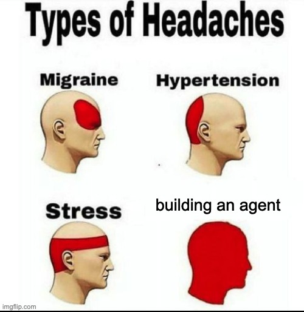

<div align="center">

 

# 🔨 Skillsmith
### __Skill this, agent that. Can I have an skill to build my agent?__

A good Claude skill takes more than just some prompts. What about making sure it doesn't cost so much to run? What about making sure it doesn't do anything funny? What if it's actually worse than just running your task in Claude Opus? 

_How can you build a skill in the shortest and cheapest way possible?_

Introducing `Skillsmith`, a comprehensive workflow do it for you at really low token usage. You're always in control. 

</div>


## 💭 When should I use this?

1. **Creating a specialist agent** (e.g. product analyst for impact estimation, product manager that looks into edge cases and interactions)
2. **Creating simple agents for specific tasks** (e.g. PDF transformer, CSV file cleaner)
3. **Auditing your own skills or agents** (e.g you built a skill but not sure what you can to improve it, other than asking the LLM for help)

## 🚀 Installation

### Option 1 — Homebrew (macOS)

```bash
brew install andychanfp/build-an-agent/build-an-agent
```

Skills install automatically and are available globally. To update to the latest version: `brew upgrade build-an-agent`.

### Option 2 — Install script
```bash
curl -fsSL https://raw.githubusercontent.com/andychanfp/build_an_agent/main/install.sh | bash
```

Installs all skills into `~/.claude/skills/` — available globally in every Claude Code session, no repo clone needed. Run the same command to update.

### Option 3 — Clone the repo

```bash
git clone --branch main --single-branch https://github.com/andychanfp/build_an_agent.git && cd ~/build_an_agent
```

Clones main branch of the repo and enters the folder automatically. Skills under `.claude/skills/` register automatically — nothing to configure. 


## 💪🏼 Workflow

--

`build_an_agent` is a linked chain: you can run tools independently, or run them as one single process. Each skill feeds into the next. 

### Processes
There are several options (non-exhaustive) on how you can build your agent or skill.

| Flow | Why |
| --- | --- |
| Run `/agent-plan` -> `/agent-build` -> `/agent-evaluate` -> `/agent-fix`  | Step-by-step process for comprehensiveness and robustness* |
| Run `/agent-ship` | Runs a quick 4-step workflow to build your agent | 
| Run `/agent-plan` and hand off to your own Claude chat, Codex, Gemini to build the agent skills | Ensure that at whichever LLM you're using is using a plan that's informed by the best practices

*_You can run the evaluation and fix agents iteratively if you're rich enough in budget._

### Example
The `design-review` skill is shipped together with this repo as an example of dogfooding. It went through the workflow of:

1. `agent-plan` to create a comprehensive plan
2. `agent-build` to build the agent based on the plan
3. `agent-evaluate` to evaluate the built agent and audit for issues
4. `agent-fix` to fix the top three issues

## ⚒️ Tools
There are 12 skills in total with 4 primary skills in the pipeline.

### Primaries
| Skill | Invocation | What it does | Outcome |
|-------|-----------|--------------|-------|
| `agent-plan` | `/agent-plan [ask]` | **Start here.** Interviews you with 3–8 MCQs, drafts a summary, persona, workflow, and two test prompts, and writes a structured plan to `plans/<name>.md`. | What are you trying to build? |
| `agent-build` | `/agent-build <plan-path>` | Validates the plan, scaffolds `.claude/skills/<name>/`, writes `SKILL.md` plus every ref file, hands off to evaluation. | Builds your agent |
| `agent-evaluate` | `/agent-evaluate <skill>` | Asks you for the specific check and mode to run, then dispatches them in parallel and creates a report (`run-[n].md`). | Runs a series of checks to improve and patch agent
| `agent-fix` | `/agent-fix <skill>` | Reads the audit run file, ranks findings by severity, shows you a fix plan, and patches `SKILL.md` and refs in place once you approve. Human approval always. | Fixes issues found

### Evaluators
Evaluator agents can be run independently or by `agent-evaluate` .


| Skill | What it does | Outcome |
|-------|-----|----------------|
| `agent-audit-test` | Generates 3–5 test cases from the skill, runs them as parallel evals, writes verifiable assertions per case. → `evals-[n].json` | Does the agent do what it's supposed to do?
| `agent-audit-grade` | Grades every assertion: LLM judge for semantic checks, tool calls for mechanical ones, `human_review` flagged but never guessed. → `grading.json` | Does the agent or skill does what it's supposed to do _well_? |
| `agent-audit-lint` | Runs `agentlinter` and `agnix`, then an LLM safety scan against the audit registry (destructive ops, secrets, code execution, prompt injection, shared-state mutation, network egress). → `audit-[n].json` | Does it do anything that it's not supposed to do? Does the tool measure against best practices and patterns? |
| `agent-audit-optimise` | Measures the skill's description trigger rate, iterates up to 5 times to improve it, validates the winner, writes it back if it actually wins. Up to 144 `claude -p` calls — token-heavy. | Does the skill actually trigger when it's supposed to? |
| `agent-audit-benchmark` | Aggregates token cost and timing — mean, stddev, pass rate. → `timing.json`, `benchmark.json` | Can it be cheaper to run the tool? |
| `agent-quality` | Runs the same task twice — once following your full SKILL.md, once with vanilla `claude-opus-4-7` given a plain-prose prompt. Scores three dimensions and tells you 🟢 skill is worth it, 🟡 marginal, or 🔴 just use Opus. | Do you really need this agent though?

###  Where things land
By default:
- **Plans** → `plans/<skill>.md`
- **Built skills** → `.claude/skills/<skill>/SKILL.md` + `refs/*`
- **Audit runs** → `.claude/skills/<skill>/run/run-[n]/` — one directory per run, auto-incremented, holding every JSON artifact (`evals`, `grading`, `audit`, `timing`, `benchmark`, `feedback`, `quality`, `fix-report`)

When planning and building, the skill will ask you where you would like output to be stored (global, desktop, or a new directory).

### Data flow

For dataflow, concurrency model, and per-subagent contracts, see `ARCHITECTURE.md`.

## ❓ FAQ

1. **Why not use Claude's skill-creator skill?** This isn't a better version of it, but a different one that considers more non-technical folks that won't need (or want to understand) the data-driven, iterative loop.
2. **Will the skill I create by really good?** Building skills and getting what you want from AI is 90% dependent on the user.
3. **What are these "best practices" though?** Using an LLM-assisted flow, I combined [academic principles](https://jdforsythe.github.io/10-principles/overview/), [best practices](https://github.com/seojoonkim/agentlinter), [Claude's own recommendations](https://resources.anthropic.com/hubfs/The-Complete-Guide-to-Building-Skill-for-Claude.pdf), and [agent skills foundations](https://leehanchung.github.io/blogs/2025/10/26/claude-skills-deep-dive/) to create a lightweight reference that this skill refers to. 
4. **But does it really cover all the best practices?** Probably not, but I operate on the 80/20 principle. 
5. **Can I contribute to this?** Shoot me a DM.
6. **Is this secure?** As far as possible, it only reads and writes in folders that you give access to and does not ask for more. In true dogfooding fashion, I also ran the `audit-lint` flow to ensure it doesn't do anything funny (e.g. prompt injections). If you spot anything, please shoot me a DM immediately. 
7. **Will you improve this?** Yes. I have ideas in mind. Roadmap WIP.
8. **Why did you decide to build this skill?** I wanted to build a skill to evaluate ideas. I then decided to build a skill to build that skill. I realised halfway through I was in too deep, and here we are. 
9.  **Did this cost a lot to build?** I may have used tokens inefficiently in the beginning.